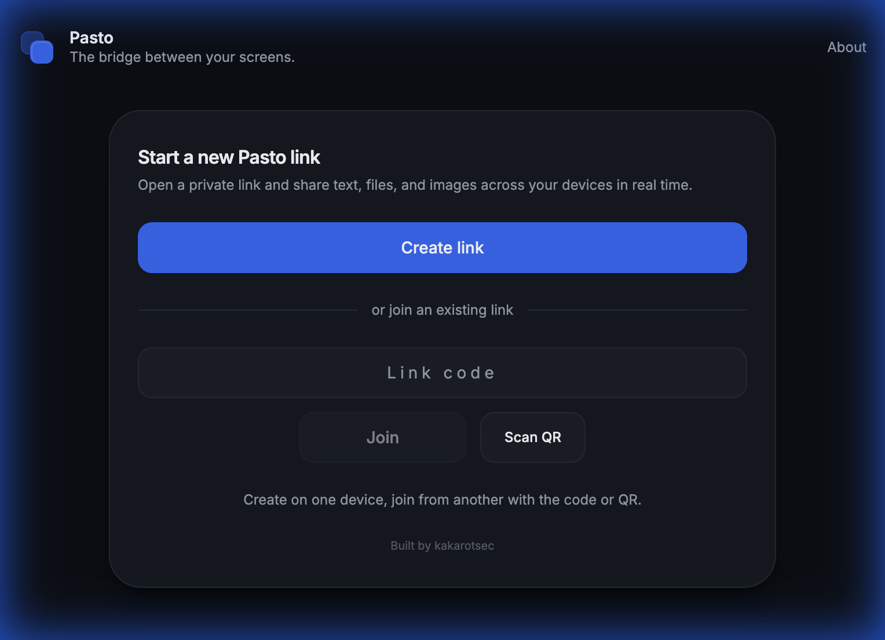
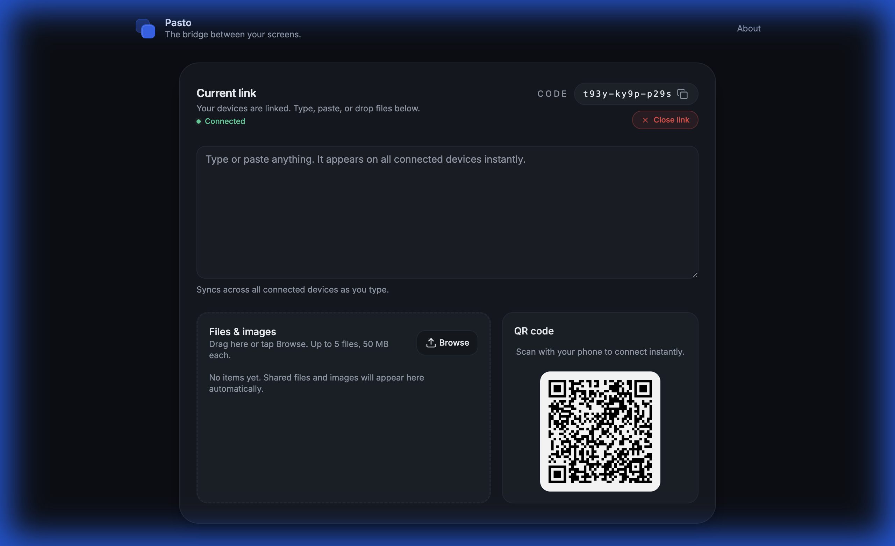

<div align="center">
  <a href="https://usepasto.vercel.app">
    
  </a>
  <h1>Pasto</h1>
  <p>
    <strong>Instant, ephemeral text and file sharing between any devices — no accounts, no installs.</strong>
  </p>
  <p>
    <a href="https://usepasto.vercel.app"><strong>usepasto.vercel.app ↗</strong></a>
  </p>
</div>

<br />

<div align="center">
  
</div>

<br />

## Features

- **Real-time text sync** — Type on one device, see it instantly on another via WebSockets.
- **File transfer** — Drag & drop up to 5 files (50 MB each) per upload.
- **QR code pairing** — Scan a code or enter a short PIN to connect devices.
- **No sign-up** — Works on any device with a browser. Zero setup.
- **Self-destructing sessions** — All data is wiped automatically after 15 minutes.
- **Unlimited devices** — Connect as many screens as you need to a single session.

## How It Works

1. Open [usepasto.vercel.app](https://usepasto.vercel.app) on your first device.
2. Scan the QR code (or enter the PIN) on your second device.
3. Paste text or drop files — everything syncs in real time.

<div align="center">
  
</div>

<br />

## internals

-   **Frontend**: React, Vite, Tailwind CSS.
-   **Realtime**: Supabase Broadcasts sync state across devices instantly (no DB latency).
-   **Privacy Architecture**:
    -   **Ephemeral**: Database rows have a strict 15-minute TTL.
    -   **Lifecycle**: A cron job triggers the `clipbeam-expire-sessions` Edge Function every 5 minutes.
    -   **Destruction**: The function performs a hard delete on both DB records and Storage objects. No soft deletes.
-   **Security**: RLS policies ensure full isolation between sessions.


## Development

```bash
git clone https://github.com/kakarotsec/pasto.git
cd pasto
npm install
cp .env.example .env
# Update .env with your Supabase keys
npm run dev
```


## Support

If Pasto saves you time, consider supporting the project.

<a href="https://www.patreon.com/15239541/join">
  
</a>

## License

MIT © [Rifat Al Jubayer](https://github.com/kakarotsec)
